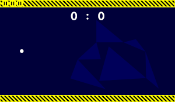

# Gravity Pong
A version of [Pong](https://en.wikipedia.org/wiki/Pong), where the ball is controlled through gravity.

## History
Created during a game jam in Dresden 2019.

## Rules
- The Ball is influenced by gravity.
- You can create a black hole (to create gravity) by holding the left mouse button.
- You can only create a black hole on your half of the screen.
- When the ball leaves the screen the enemy wins a point.
- When the ball touches your black hole the enemy wins a point.
- First to 17 points wins.
- Using right click you can consume a powerup and stop the ball at its current position.
- Powerups can spawn on the enemy side of the screen.
- The enemy can neither see nor collect that powerup.
- When the ball passes through that powerup, you gain it.

## Problems
You can't restart the game or go back to the main menu.
Just restart the executable in such a case.

## Firewall
The connection is established via UDP on port 12395.

## Building
Open the project with [Godot](https://godotengine.org/) and hit F5.

## License
- Assets: CC-BY
- Everything else: MIT
